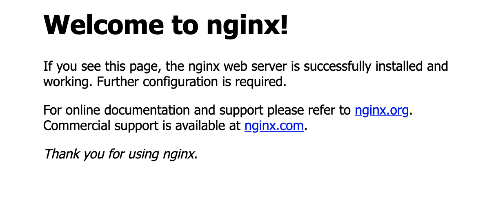

# Ubuntu server for deployment

> Ashish Bhatt \| Oct 8 2019

## Users

Default contents of `/etc/passwd` file this contains all user informations this is colon separated first element is username second represents x which historically used to have password hash. Followed by user id, group id, description, home directory and at the end default shell.

```bash
# cat /etc/passwd

root:x:0:0:root:/root:/bin/bash
daemon:x:1:1:daemon:/usr/sbin:/usr/sbin/nologin
bin:x:2:2:bin:/bin:/usr/sbin/nologin
sys:x:3:3:sys:/dev:/usr/sbin/nologin
sync:x:4:65534:sync:/bin:/bin/sync
games:x:5:60:games:/usr/games:/usr/sbin/nologin
man:x:6:12:man:/var/cache/man:/usr/sbin/nologin
```

Add a new user

```bash
$ adduser newUserNameHere
```

or

```bash
$ useradd newUserNameHere
```

## Groups

Listing all groups on a linux system

```bash
# cat /etc/group

root:x:0:
daemon:x:1:
bin:x:2:
sys:x:3:
adm:x:4:syslog
tty:x:5:
disk:x:6:
lp:x:7:
mail:x:8:
news:x:9:
uucp:x:10:
man:x:12:
proxy:x:13:
```

* **group\_name**: It is the name of group. If you run `ls -l` command, you will see this name printed in the group field.
* **Password**: Generally password is not used, hence it is empty/blank. It can store encrypted password. This is useful to implement privileged groups.
* **Group ID \(GID\)**: Each user must be assigned a group ID. You can see this number in your `/etc/passwd` file.
* **Group List**: It is a list of user names of users who are members of the group. The user names, must be separated by commas.

Adding a new group

```bash
$ groupadd newGroupHere
```

or to delete a group

```bash
$ groupdel groupToBeDeleted
```

Added user to a group

```bash
$ sudo usermod -a -G groupname username
```

## Some important commands

* **adduser**: add a user to the system.
* **userdel**: delete a user account and related files.
* **addgroup**: add a group to the system.
* **delgroup**: remove a group from the system.
* **usermod**: modify a user account.
* **chage**: change user password expiry information.
* **sudo**: run one or more commands as another user \(typically with superuser permissions\).
* **id**: to display the user details

> Relevant files: `/etc/passwd` \(user information\), `/etc/shadow` \(encrypted passwords\), `/etc/group` \(group information\) and `/etc/sudoers` \(configuration for sudo\).

## Steps

* Create a new user

  ```bash
  $ adduser ashish
  ```

* Create a new group

  ```bash
  $ addgroup maint
  ```

* Add new user to the group

  ```bash
  $ sudo usermod -g maint ashish
  ```

* Delete the group ashish

  ```bash
  $ groupdel ashish
  ```

* Add user to sudoer list

  ```bash
  # usermod -a -G sudo ashish
  ```

## Installing NGINX on ubuntu

1. Install nginx

   ```bash
   $ sudo apt install nginx
   ```

2. check firewall settings

   ```bash
   $ sudo ufw app list
   ```

   > Output
   >
   > ```text
   > Available applications:
   > Nginx Full
   > Nginx HTTP
   > Nginx HTTPS
   > OpenSSH
   > ```

3. Allow traffic 

   ```bash
   $ sudo ufw allow 'Nginx HTTP'
   ```

4. Check server status

   ```bash
   $ systemctl status nginx
   ```

5. Open browser and type the ip of the server to see something like below

   

